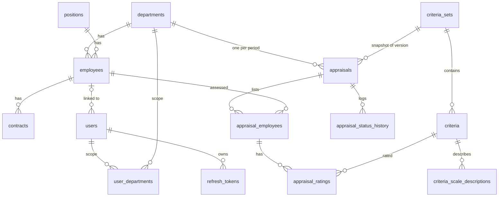
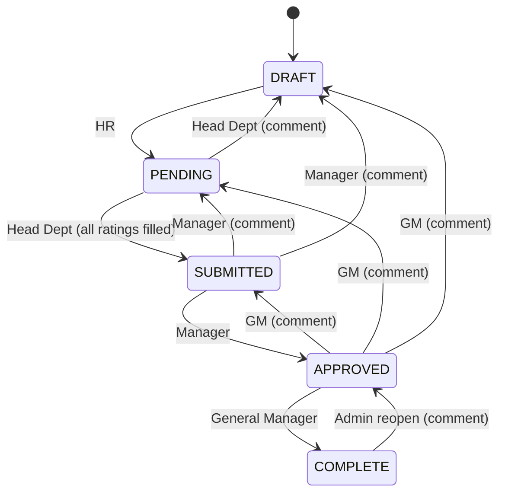

# Backend Design: Employee Performance Appraisal System

**Based on:** PRD v0.4 (`docs/PRD.md`, the latest version) and the installed dependencies in `apps/backend/package.json`
**Scope:** `apps/backend` only (NestJS + TypeScript + Drizzle + PostgreSQL). Frontend design lives in `DESIGN-FRONTEND.md`.
**Status:** Draft v0.3 (aligned with installed dependencies and PRD v0.4)

---

## 1. Decisions that go beyond the PRD

The PRD does not specify these, so this document decides them. Review them first.

| # | Decision | Reason |
|---|---|---|
| 1 | Auth uses `@nestjs/passport` + `passport-jwt` to validate access tokens and `@nestjs/jwt` (`JwtService`) to sign and verify tokens. `jsonwebtoken` is not a direct dependency. | Matches the installed dependencies and the standard NestJS approach. |
| 2 | Entity tables use `uuid` primary keys; `audit_logs` and `appraisal_status_history` use `bigint` identity. | UUIDs are safe to expose in URLs and Excel templates; logs are append-only and benefit from ordered ids. |
| 3 | Ratings are **kept** when an appraisal is sent back (to PENDING or DRAFT). | Avoids losing the assessor's work; the status history shows what happened. |
| 4 | `total_score` is `NULL` until every rating of that employee is filled. | Prevents misleading partial scores. |
| 5 | Department scope for Head Department and Manager comes from a `user_departments` table. | PRD says users have one or more assigned departments. |
| 6 | Role and `is_active` are re-read from the database on every authenticated request. | Deactivation and role changes take effect immediately, not at token expiry. |
| 7 | `contract_type` is a validated string (list in code), not a database enum. | PRD lists types as "permanent, fixed-term, etc."; the list will likely grow. |
| 8 | The day-1 scheduler is protected by a PostgreSQL advisory lock. | Safe when more than one backend instance runs. |
| 9 | Env validation uses a `validate` function built with `class-validator`; DTO helpers (`PartialType`, etc.) come from `@nestjs/swagger`, not `@nestjs/mapped-types`. | No extra library; keeps Swagger metadata. |
| 10 | Production migrations run through a small script using the migrator from `drizzle-orm`; `drizzle-kit` stays a dev tool. | `drizzle-kit` and `dotenv` are dev dependencies and are not in the production image. |
| 11 | No `helmet`, logging library, health-check library, or date library is installed, so the design does not use them. Security headers come from the reverse proxy; health is a hand-written endpoint. | Design only depends on what is installed. Each can be added later (section 3.1). |

## 2. Architecture

```
React app  ──HTTPS──►  NestJS REST API (/api)  ──►  PostgreSQL
                          │
                          ├─ Scheduler (@nestjs/schedule, in-process)
                          └─ Excel import/export (exceljs, in-memory)
```

- One deployable backend. No message queue, no file storage: uploaded files are processed in memory (max 5 MB) and never stored.
- Stateless API. All state is in PostgreSQL.

## 3. Tech stack

| Concern | Choice |
|---|---|
| Runtime | Node.js 24, TypeScript 5.7 (strict) |
| Framework | NestJS 11 |
| Database / ORM | PostgreSQL, Drizzle ORM, `drizzle-kit` migrations |
| Auth | `@nestjs/passport` + `passport` + `passport-jwt` (access token validation), `@nestjs/jwt` (sign and verify, HS256), `bcrypt` |
| Validation | `class-validator` + `class-transformer` (global `ValidationPipe`, `whitelist`, `forbidNonWhitelisted`) |
| DTO helpers | `PartialType`, `OmitType`, etc. imported from `@nestjs/swagger` |
| API docs | `@nestjs/swagger` |
| Scheduling | `@nestjs/schedule` |
| Config | `@nestjs/config` with a `validate` function built on `class-validator`; the app refuses to boot on invalid env |
| Excel | `exceljs`; file upload via Multer (included in `@nestjs/platform-express`, types from `@types/multer`) |
| Request context | `nestjs-cls` (carries current user, IP, request id for audit and logs) |
| Rate limiting | `@nestjs/throttler` on auth endpoints |
| CORS / headers | CORS restricted to `CORS_ORIGIN` via `app.enableCors`. Security headers are set by the reverse proxy (`helmet` is not installed, see 3.1) |
| Testing | Jest + ts-jest, Supertest, PostgreSQL started with docker-compose for e2e |

### 3.1 Installed packages and how the design uses them

| Package | Used for |
|---|---|
| `@nestjs/jwt` | `JwtService` signs and verifies access and refresh tokens (separate secrets) |
| `@nestjs/passport`, `passport`, `passport-jwt` | `JwtStrategy` and `JwtAuthGuard` for access tokens |
| `bcrypt` | Password hashing (native module, see section 17) |
| `@nestjs/throttler` | Rate limit on `/auth/login` and `/auth/refresh` |
| `nestjs-cls` | Request context: current user, IP, request id for audit and logs |
| `exceljs` | Reading and writing `.xlsx` for all imports and exports |
| `@types/multer` | Types for uploaded files (`Express.Multer.File`) |
| `drizzle-orm`, `pg` | Database access through the `node-postgres` driver (pool) |
| `drizzle-kit` (dev) | Generating migrations (`generate`, `--custom`) |
| `@nestjs/schedule` | Day-1 appraisal job |
| `@nestjs/swagger` | API docs and DTO helpers |
| `@nestjs/config`, `class-validator`, `class-transformer` | Env validation and DTO validation |
| `@nestjs/mapped-types` | Installed but not used; import helpers from `@nestjs/swagger` instead |

**Not installed (optional later):** `helmet` (security headers, if the API is exposed without a reverse proxy), a structured logger such as pino, `@nestjs/terminus` (health checks), `@testcontainers/postgresql` (e2e database), a date library (period math lives in a small tested `period.util.ts`).

## 4. Project structure

```
apps/backend/
  drizzle.config.ts
  drizzle/                      # generated SQL migrations (never edit existing files)
  src/
    main.ts                     # /api prefix, Swagger, ValidationPipe, CORS
    app.module.ts
    config/                     # env schema and typed config
    database/
      database.module.ts        # pg Pool + Drizzle instance and transaction helper
      migrate.ts                # production migration script (drizzle-orm migrator)
      schema/                   # one file per table group, exported from index.ts
      helpers/                  # notDeleted(), pagination, advisory lock
    common/
      auth/                     # JwtAuthGuard, RolesGuard, @Public(), @Roles(), @CurrentUser()
      scope/                    # ScopeService (department scope)
      errors/                   # AppException, error codes, global filter
      pagination/
    modules/
      auth/                     # controller, service, jwt.strategy.ts, token handling
      users/  departments/  positions/  employees/  contracts/
      criteria/                 # criteria sets (versioning)
      appraisals/               # creation, ratings, workflow, scoring
      imports/                  # shared import pipeline + per-module importers
      exports/                  # Excel writers
      audit/
      scheduler/                # day-1 appraisal generation
    seed/                       # seed script (admin user, initial criteria set)
  test/                         # e2e tests
```

Module pattern: `*.module.ts`, `*.controller.ts` (HTTP only), `*.service.ts` (business rules), `*.repository.ts` (Drizzle queries), `dto/`.

Rules:
- Controllers contain no business logic.
- Only repositories import Drizzle tables and build queries.
- Services accept an optional transaction executor so several services can join one transaction.

## 5. Conventions

| Topic | Convention |
|---|---|
| Prefix | All routes under `/api` |
| Naming | Tables `snake_case` plural; TS columns `camelCase`; routes `kebab-case` plural |
| Dates | `date` for calendar dates (join date, contract dates, period); `timestamptz` for timestamps. Server timezone `Asia/Jakarta` (`TZ` env) for scheduler and period calculations. Month and period math lives in one tested `period.util.ts` (no date library installed) |
| Soft delete | `deleted_at` (+ `deleted_by`) on masters and appraisals. Every query goes through `notDeleted(table)`; repositories never forget the filter |
| Pagination | `?page=1&pageSize=20&sort=field:asc&q=search` → `{ data, meta: { page, pageSize, total } }`. `pageSize` max 100 |
| Timestamps | `created_at`, `updated_at`, and `created_by` / `updated_by` where relevant |
| Transactions | Any operation that writes more than one row or changes status runs in one transaction, including its audit entry |

**Error format**

```json
{
  "statusCode": 422,
  "code": "APPRAISAL_INVALID_TRANSITION",
  "message": "Cannot move from DRAFT to COMPLETE",
  "details": {}
}
```

| Status | Used for |
|---|---|
| 400 | Request validation errors |
| 401 | Missing or invalid token |
| 403 | Role or department scope not allowed |
| 404 | Not found (also used for out-of-scope records to avoid leaking existence) |
| 409 | Uniqueness conflicts (employee number, appraisal already exists for department and period) |
| 422 | Business rule violations and failed imports |

## 6. Configuration (`.env`)

| Variable | Example / default | Purpose |
|---|---|---|
| `NODE_ENV` | `development` | |
| `PORT` | `3000` | |
| `TZ` | `Asia/Jakarta` | Scheduler and period dates |
| `DATABASE_URL` | `postgres://...` | App user (no update/delete on `audit_logs`) |
| `JWT_ACCESS_SECRET` | | Min 32 chars |
| `JWT_ACCESS_EXPIRES_IN` | `15m` | |
| `JWT_REFRESH_SECRET` | | Different from access secret |
| `JWT_REFRESH_EXPIRES_IN` | `7d` | |
| `BCRYPT_ROUNDS` | `12` | |
| `CORS_ORIGIN` | `http://localhost:5173` | |
| `SWAGGER_ENABLED` | `true` | Disable or protect in production |
| `IMPORT_MAX_FILE_SIZE_MB` | `5` | PRD 5.7 |
| `IMPORT_MAX_ROWS` | `5000` | PRD 5.7 |
| `SCHEDULER_ENABLED` | `true` | |
| `APPRAISAL_SCHEDULE_CRON` | `0 1 1 * *` | Day 1 of each month, 01:00 |
| `APPRAISAL_LOOKAHEAD_MONTHS` | `1` | Contracts ending in the following month |
| `SEED_ADMIN_USERNAME` / `SEED_ADMIN_PASSWORD` | | First admin, used by seed only |

A `.env.example` with every variable is committed. Real `.env` files are never committed.

## 7. Data model

Roles: `ADMIN`, `HR`, `HEAD_DEPARTMENT`, `MANAGER`, `GENERAL_MANAGER`.
Appraisal status: `DRAFT`, `PENDING`, `SUBMITTED`, `APPROVED`, `COMPLETE`.
Criteria set status: `DRAFT`, `ACTIVE`, `SUPERSEDED`.

### 7.1 Overview



### 7.2 Tables

**users**

| Column | Type | Notes |
|---|---|---|
| id | uuid PK | |
| username | varchar unique | |
| password_hash | varchar | bcrypt |
| full_name | varchar | |
| role | enum | one role per user |
| employee_id | uuid FK nullable | optional link |
| is_active | boolean | |
| last_login_at, created_at, updated_at | timestamptz | |

**user_departments**: `user_id`, `department_id`, PK (user_id, department_id). Used for HEAD_DEPARTMENT and MANAGER.

**refresh_tokens**: `id` (= JWT `jti`), `user_id`, `token_hash` (SHA-256), `expires_at`, `revoked_at`, `replaced_by`, `created_at`, `ip`, `user_agent`.

**departments**: `id`, `code` unique, `name`, `head_employee_id` nullable FK, `is_active`, audit and `deleted_at` columns.

**positions**: `id`, `code` unique, `name`, `level` int, `is_active`, `deleted_at`.

**employees**

| Column | Type | Notes |
|---|---|---|
| id | uuid PK | |
| employee_number | varchar | unique among non-deleted rows |
| full_name | varchar | |
| gender | enum | |
| birth_date | date | |
| address | text | |
| department_id | uuid FK | |
| position_id | uuid FK | |
| join_date | date | |
| status | enum `ACTIVE` / `INACTIVE` | |
| superior_id | uuid FK nullable | self reference |
| created_at, updated_at, deleted_at | | |

Indexes: `(department_id)`, `(status)`, trigram or lower-case index on `full_name` for search.

**contracts**

| Column | Type | Notes |
|---|---|---|
| id | uuid PK | |
| employee_id | uuid FK | |
| contract_type | varchar | validated list in code |
| start_date | date | |
| end_date | date nullable | null = permanent |
| status | enum `ACTIVE` / `INACTIVE` | |
| created_at, updated_at, deleted_at | | |

Constraints:
- Unique `(employee_id, start_date)` where not deleted (import match key).
- **Exclusion constraint** so one employee cannot have two ACTIVE contracts with overlapping dates:
  `EXCLUDE USING gist (employee_id WITH =, daterange(start_date, coalesce(end_date, 'infinity'), '[]') WITH &&) WHERE (status = 'ACTIVE' AND deleted_at IS NULL)` (needs `btree_gist`). Drizzle cannot express this, so it goes in a custom SQL migration.
- Check `end_date IS NULL OR end_date >= start_date`.
- Index `(end_date)` for the scheduler query.

**criteria_sets**

| Column | Type | Notes |
|---|---|---|
| id | uuid PK | |
| version | int unique | increasing |
| status | enum | |
| effective_date | date nullable | |
| note | text | change reason |
| created_by, created_at, activated_by, activated_at | | who changed it and when |

Constraint: partial unique index on `(status)` where `status = 'ACTIVE'` → only one active set.

**criteria**: `id`, `criteria_set_id` FK, `code`, `name`, `description`, `scale_min` int, `scale_max` int, `weight` numeric(5,2), `display_order`. Unique `(criteria_set_id, code)`. Check `scale_min < scale_max` and `weight > 0`.

**criteria_scale_descriptions**: `id`, `criterion_id` FK, `score` int, `description`. Unique `(criterion_id, score)`.

**appraisals**

| Column | Type | Notes |
|---|---|---|
| id | uuid PK | |
| department_id | uuid FK | |
| period | date | first day of the target month |
| criteria_set_id | uuid FK | snapshot reference |
| status | enum | |
| source | enum `MANUAL` / `SCHEDULER` | |
| created_by | uuid FK nullable | null for scheduler |
| created_at, updated_at | | |
| deleted_at, deleted_by | | soft delete (DRAFT only) |

Constraints: **partial unique index** `(department_id, period)` where `deleted_at IS NULL`. Check `period = date_trunc('month', period)`. Index `(status)`, `(department_id, status)`.

**appraisal_employees** (the table rows, with snapshot)

| Column | Type | Notes |
|---|---|---|
| id | uuid PK | |
| appraisal_id | uuid FK | |
| employee_id | uuid FK | |
| employee_number, employee_name | varchar | snapshot |
| department_id, department_name | | snapshot |
| position_id, position_name | | snapshot |
| contract_id, contract_type, contract_end_date | | snapshot |
| comment | text nullable | |
| total_score | numeric(5,2) nullable | null until all ratings filled |

Unique `(appraisal_id, employee_id)`.

**appraisal_ratings**: `id`, `appraisal_employee_id` FK, `criterion_id` FK, `rating` int, `updated_by`, `updated_at`. Unique `(appraisal_employee_id, criterion_id)`. Range check against the criterion's scale is done in the service (a check constraint cannot read another table).

**appraisal_status_history**: `id` bigint, `appraisal_id`, `from_status`, `to_status`, `action` (`TRANSITION` / `SEND_BACK` / `REOPEN`), `comment`, `actor_user_id`, `created_at`.

**audit_logs** (see section 12)

| Column | Type |
|---|---|
| id | bigint identity |
| occurred_at | timestamptz |
| actor_type | `USER` / `SYSTEM` |
| user_id, username, role, employee_number | nullable text/uuid |
| action | varchar (e.g. `APPRAISAL_STATUS_CHANGED`) |
| entity, entity_id | varchar |
| before_data, after_data | jsonb |
| metadata | jsonb (file name, import summary, filters) |
| ip_address, request_id | varchar |

## 8. Authentication and authorization

### 8.1 Login and tokens

1. `POST /api/auth/login` with username and password. Compare using `bcrypt`. Same error message for unknown user and wrong password. Throttled.
2. Issue an **access token** (`sub`, `role`, `typ: "access"`, 15 min) and a **refresh token** (`sub`, `jti`, `typ: "refresh"`, 7 days), signed with `JwtService.signAsync`, each with its own secret and expiry passed per call (`JwtModule` is registered without a default secret). The algorithm is fixed to HS256 when signing and when verifying (`verifyAsync` options and the strategy's `algorithms`).
3. Store the SHA-256 hash of the refresh token with its `jti`.
4. `POST /api/auth/refresh`: verify with `JwtService.verifyAsync` using the refresh secret and check `typ = "refresh"`, find the stored hash, **rotate** (revoke the old token, issue a new pair). If a revoked token is presented again, revoke all tokens of that user (reuse detection).
5. `POST /api/auth/logout` revokes the refresh token.
6. Deactivating a user or resetting a password revokes all of that user's refresh tokens.

Where the frontend keeps tokens is described in `DESIGN-FRONTEND.md`.

### 8.2 Guards

| Guard | Does |
|---|---|
| `JwtAuthGuard` (global, extends `AuthGuard('jwt')`) | Skips routes marked `@Public()` (login, refresh). Otherwise `JwtStrategy` verifies the access token (access secret, `ignoreExpiration: false`, `algorithms: ['HS256']`, `typ` must be `access` so a refresh token cannot be used as an access token). `validate(payload)` loads the user from the database and rejects if missing or `is_active = false`. The returned user (role from the database row, not from the token) becomes `request.user` and is copied into the request context (`nestjs-cls`) |
| `RolesGuard` (global) | Checks `@Roles(...)` on the route |
| `ScopeService` | Returns the department ids a user may access. ADMIN, HR, GM → all. HEAD_DEPARTMENT, MANAGER → rows in `user_departments`. Used in repository queries and in service checks |

Role checks answer "may this role call this endpoint". Scope checks answer "may this user touch this department's data". Both are enforced on the server for every endpoint. Out-of-scope records return 404.

### 8.3 Permission matrix in code

The PRD matrix (5.8) is implemented as one data structure (`permissions.ts`) that controllers and services read, not as scattered `if` statements. A table-driven e2e test walks every row of the PRD matrix.

## 9. Appraisal workflow

### 9.1 State machine



### 9.2 Transition rules as data

```ts
export const TRANSITIONS: TransitionRule[] = [
  // forward
  { from: 'DRAFT',     to: ['PENDING'],   roles: ['HR'],              kind: 'TRANSITION', requires: ['hasEmployees'] },
  { from: 'PENDING',   to: ['SUBMITTED'], roles: ['HEAD_DEPARTMENT'], kind: 'TRANSITION', scoped: true, requires: ['allRatingsFilled'] },
  { from: 'SUBMITTED', to: ['APPROVED'],  roles: ['MANAGER'],         kind: 'TRANSITION', scoped: true },
  { from: 'APPROVED',  to: ['COMPLETE'],  roles: ['GENERAL_MANAGER'], kind: 'TRANSITION' },
  // send back (comment mandatory)
  { from: 'PENDING',   to: ['DRAFT'],                         roles: ['HEAD_DEPARTMENT'],       kind: 'SEND_BACK', comment: true, scoped: true },
  { from: 'SUBMITTED', to: ['PENDING', 'DRAFT'],              roles: ['MANAGER'],               kind: 'SEND_BACK', comment: true, scoped: true },
  { from: 'APPROVED',  to: ['SUBMITTED', 'PENDING', 'DRAFT'], roles: ['GENERAL_MANAGER'],       kind: 'SEND_BACK', comment: true },
  // reopen
  { from: 'COMPLETE',  to: ['APPROVED'],  roles: ['ADMIN'],           kind: 'REOPEN', comment: true },
];
```

The service never hard-codes a transition outside this table. Unit tests cover every row plus every missing combination.

### 9.3 Transition execution

`AppraisalWorkflowService.transition(appraisalId, targetStatus, comment, actor)`:

1. Open a transaction and `SELECT ... FOR UPDATE` the appraisal row (prevents two people changing status at once).
2. Check scope (Head Department and Manager rows).
3. Find the matching rule for `(current status, target, actor role)`. No match → 422 `APPRAISAL_INVALID_TRANSITION` (or 403 if the role is simply not allowed).
4. Check mandatory comment and preconditions (`hasEmployees`, `allRatingsFilled`).
5. Update status, insert `appraisal_status_history`, insert audit log. Commit.

### 9.4 Other appraisal rules

| Rule | Enforcement |
|---|---|
| Ratings editable only in PENDING by Head Department of that department | Service check on every rating write and import |
| Employee list editable only in DRAFT by HR | Service check |
| Soft delete only in DRAFT, by HR | Sets `deleted_at` / `deleted_by`, audited. Frees the department and period for a new appraisal |
| COMPLETE is read-only | All write paths reject unless status allows |
| Rating within criterion scale and criterion belongs to the appraisal's criteria set | Service validation |
| Submit requires every employee × criterion cell filled | `allRatingsFilled` precondition |

## 10. Appraisal creation, scoring, and scheduler

### 10.1 Eligibility query

An employee is eligible for `(department, period)` when:
- `employees.department_id = department`, `status = 'ACTIVE'`, `deleted_at IS NULL`
- has a contract with `status = 'ACTIVE'`, `deleted_at IS NULL`, and `end_date` between the first and last day of the period month
- is not already in another non-deleted, not COMPLETE appraisal for the same period

### 10.2 Manual creation

| Endpoint | Behavior |
|---|---|
| `POST /appraisals/preview` | Body: `departmentId`, `period`. Returns eligible employees; writes nothing |
| `POST /appraisals` | Body: `departmentId`, `period`, `employeeIds`. In one transaction: check active criteria set exists, check unique (department, period), check each employee is active and in the department, take snapshots, insert appraisal (DRAFT, `source = MANUAL`) and rows |
| `PUT /appraisals/:id/employees` | DRAFT only. Add or remove employees; added employees get a fresh snapshot |

Concurrent creation for the same department and period is resolved by the partial unique index (second request gets 409).

### 10.3 Scheduler

- `@Cron(APPRAISAL_SCHEDULE_CRON, { timeZone })`, active only when `SCHEDULER_ENABLED=true`.
- Target period = first day of (today + `APPRAISAL_LOOKAHEAD_MONTHS` months).
- Run steps:
  1. Try `pg_try_advisory_lock(key)`. If not acquired, another instance is running; exit.
  2. Load the active criteria set. If none, log an error and stop.
  3. For every active department, run the eligibility query. Skip if the result is empty.
  4. In one transaction per department: insert the appraisal (`source = SCHEDULER`, `created_by = NULL`) with `ON CONFLICT DO NOTHING` on the partial unique index, then insert rows with snapshots. If the insert is a no-op, skip.
  5. Write one audit entry per created appraisal (actor `SYSTEM`) and one summary entry for the run (created, skipped, failed).
  6. Release the lock.
- A failure in one department does not stop the others.
- An admin-only endpoint `POST /api/scheduler/appraisals/run` (target period optional) reruns the job manually. It is idempotent for the same reason.

### 10.4 Score calculation

Pure function in `appraisal-score.ts`, no database access:

```
total = Σ over criteria ( rating / scale_max × weight )     // weights total 100
```

- Result is 0-100, rounded to 2 decimals, stored in `appraisal_employees.total_score`.
- If any rating of the employee is missing, `total_score = NULL`.
- Recalculated inside the same transaction whenever ratings are saved or imported.
- Unit tests cover mixed scales (e.g. 1-5 and 1-10 in the same set), missing ratings, and rounding.

## 11. Criteria set versioning

1. `POST /criteria-sets` creates a new **DRAFT** set, copying the active set (version = max + 1).
2. `PUT /criteria-sets/:id` edits a DRAFT set: add, edit, remove, reorder criteria, change weights, scales, and score descriptions. Only DRAFT sets are editable.
3. `POST /criteria-sets/:id/activate` validates, then in one transaction marks the current ACTIVE set `SUPERSEDED` and the new set `ACTIVE`.

Validation at activation: weights total exactly 100; every criterion has `scale_min < scale_max`; every score level in the scale has a description; codes are unique inside the set.

An active or superseded set is never edited or deleted. Appraisals reference their `criteria_set_id`, so past results do not change. Version history is `GET /criteria-sets` (who, when, note).

## 12. Audit trail

### 12.1 Recording

- `AuditService.record(executor, entry)` is called by services **inside the same transaction** as the change, so an action and its audit entry commit or fail together.
- The actor (user id, username, role, employee number, IP, request id) is read from the request context (`nestjs-cls`). The scheduler passes `actor_type = SYSTEM`.
- `before_data` / `after_data` store only the changed fields for updates.
- Login, logout, failed login, imports, and exports are audited too (imports and exports store file name, filters, and result summary in `metadata`).
- **Masking:** `AuditService` removes or replaces values of keys matching a deny-list (`password`, `passwordHash`, `token`, `refreshToken`, `secret`, and similar) before saving. Masking is applied centrally, not by each caller. Application logs follow the same rule.

### 12.2 Immutability and retention

- No controller, service, or role can update or delete audit rows.
- The application database user has only `INSERT` and `SELECT` on `audit_logs`:

```sql
REVOKE ALL ON audit_logs FROM app_user;
GRANT SELECT, INSERT ON audit_logs TO app_user;
GRANT USAGE ON SEQUENCE audit_logs_id_seq TO app_user;
```

- `audit_logs` is **partitioned by month** on `occurred_at` (custom SQL migration; a monthly job or migration creates upcoming partitions).
- Retention is 12 months. A database administrator removes older data by detaching and dropping monthly partitions, following a documented procedure. Each purge is recorded outside the audit table (date, operator, cutoff date, row count).
- Indexes: `(occurred_at)`, `(entity, entity_id)`, `(user_id, occurred_at)`.

## 13. Excel import and export

### 13.1 Import pipeline (shared)

Each importer (employees, contracts, assessment ratings) implements the same interface and is run by one `ImportService`:

```
upload ► file checks ► parse ► validate (stop at first error) ► commit in one transaction ► audit
```

| Step | Rule |
|---|---|
| Upload | `multipart/form-data` via `FileInterceptor` with Multer memory storage; `limits.fileSize` from `IMPORT_MAX_FILE_SIZE_MB` |
| File checks | Extension and content are really `.xlsx`; row count ≤ `IMPORT_MAX_ROWS`; header row matches the template exactly |
| Parse | Read with `exceljs`; trim strings; typed conversion (dates, numbers) |
| Validate | Run row rules in order and **stop at the first error**. Nothing is written during validation |
| Commit | One transaction. Any failure rolls everything back |
| Result | Success: `{ created, updated, skipped }`. Failure: HTTP 422 with `{ row, column, message }` of the first error only |
| Audit | One entry with file name, uploader, time, result |

A shared cross-row check (for example duplicate keys inside the file) counts as an error like any other, reported at the first offending row.

### 13.2 Importers

| Importer | Match key | Key validations |
|---|---|---|
| Employees (sync) | `employee_number` | Required fields; department and position codes exist and are active; valid enums and dates; no duplicate employee numbers in file; superior employee number exists in DB or file. Existing rows are updated, new rows created. Employees missing from the file are left unchanged |
| Contracts | `employee_number` + `start_date` | Employee exists; valid dates; `end_date ≥ start_date`; no overlapping ACTIVE contracts (against DB and inside the file) |
| Assessment ratings | appraisal id from template | See below |

**Assessment ratings import** (`POST /appraisals/:id/assessment-import`)
- Allowed only for Head Department of that department and only when the appraisal is PENDING.
- The template has a hidden metadata sheet with appraisal id, period, and criteria set version. All three must match the target appraisal. The hidden sheet is a consistency check, not a security control; the real checks are against the database.
- Employees must belong to the appraisal; criteria columns must match the appraisal's criteria set; ratings must be integers inside each criterion's scale.
- Valid ratings overwrite existing ones; overwrites are recorded in audit (`before` / `after`). Scores are recalculated in the same transaction.

### 13.3 Templates and exports

| Endpoint | Output |
|---|---|
| `GET /employees/import-template`, `GET /contracts/import-template` | Header row, example row, notes sheet with allowed values |
| `GET /employees/export`, `GET /contracts/export` | Respects the same filters as the list screen |
| `GET /appraisals/:id/assessment-template` | Employees of the appraisal × one column per criterion, with the metadata sheet. Also serves as the import template |
| `GET /appraisals/:id/export-result` | Employees, ratings per criterion, total score, status, snapshot fields |

Rules for all exports:
- Respect role and department scope exactly like list endpoints.
- Sanitize cell values that start with `=`, `+`, `-`, or `@` (prefix with `'`) to prevent spreadsheet formula injection.
- Use `exceljs` streaming writer for large exports.
- Every export is audited with its filters.

## 14. API overview

Full contract is generated by Swagger. Conventions above apply to every endpoint.

| Group | Endpoints | Roles |
|---|---|---|
| Auth | `POST /auth/login`, `/auth/refresh`, `/auth/logout`; `GET /auth/me` | public / any user |
| Users | `GET, POST /users`; `GET, PUT /users/:id`; `POST /users/:id/reset-password`; `PATCH /users/:id/status` | ADMIN |
| Departments, positions | `GET /departments`, `/positions` (all roles, scoped); `POST, PUT, PATCH status` | ADMIN write |
| Employees | `GET /employees`, `GET /employees/:id`; `POST`, `PUT`, `PATCH status`; `POST /employees/import`; export and template | ADMIN, HR write; others read in scope |
| Contracts | Same shape as employees | ADMIN, HR write; others read in scope |
| Criteria sets | `GET /criteria-sets`, `GET /criteria-sets/active`, `POST`, `PUT /:id`, `POST /:id/activate` | ADMIN, HR write; others read |
| Appraisals | `GET /appraisals`, `GET /appraisals/:id`, `POST /appraisals/preview`, `POST /appraisals`, `PUT /:id/employees`, `DELETE /:id` (soft), `PUT /:id/ratings`, `POST /:id/transition`, `GET /:id/history` | per workflow rules |
| Appraisal files | `GET /:id/assessment-template`, `POST /:id/assessment-import`, `GET /:id/export-result` | per matrix 5.8 |
| Audit | `GET /audit-logs` (filters: user, entity, action, date range); export (P1) | ADMIN, HR |
| Scheduler | `POST /scheduler/appraisals/run` | ADMIN |

`POST /appraisals/:id/transition` body: `{ "to": "PENDING", "comment": "..." }`. The backend decides from the current status and `to` whether it is a forward move, send-back, or reopen.

`PUT /appraisals/:id/ratings` body: bulk upsert of `{ appraisalEmployeeId, criterionId, rating }` plus optional row comments. Partial saves are allowed in PENDING.

## 15. Security checklist

- Server-side role and department scope on every endpoint; out-of-scope records return 404.
- Passwords hashed with bcrypt; never returned, logged, or stored in audit values.
- Two JWT secrets, algorithm pinned, short access token lifetime, refresh token rotation with reuse detection.
- Login throttled; same error for unknown user and wrong password.
- Restricted CORS and DTO whitelisting (unknown fields rejected). Security headers come from the reverse proxy; add `helmet` if the API is ever exposed without one.
- `JwtStrategy` pins HS256 and rejects tokens whose `typ` is not `access`.
- Parameterized queries only (Drizzle); no string-built SQL except reviewed custom migrations.
- Upload limits enforced before parsing; files processed in memory and never stored.
- Excel formula injection sanitized on export.
- Swagger disabled or protected in production.
- Secrets only via environment variables.

## 16. Testing strategy

| Level | What |
|---|---|
| Unit | Score calculation, transition rules table (all allowed and all forbidden combinations), eligibility rules, criteria set validation, audit masking, each importer's validation order |
| Integration / e2e (Supertest + real PostgreSQL via docker-compose) | Table-driven permission test over the PRD matrix; full workflow DRAFT → COMPLETE with send-backs and reopen; scope isolation between two departments; criteria activation; scheduler idempotency (run twice, one appraisal); concurrent transitions; every import fails whole on first error and leaves no data; audit entry exists for every write |
| Database | Constraints actually reject bad data: duplicate appraisal per department and period, overlapping active contracts, two active criteria sets, `UPDATE`/`DELETE` on `audit_logs` as `app_user` |

Priority order when time is short: workflow, permissions and scope, imports, scheduler, scoring.

## 17. Migrations, seed, and deployment

- Schema in `src/database/schema`. Generate with `drizzle-kit generate`, apply with `drizzle-kit migrate`. Never edit generated migrations and never use `push` on shared databases.
- Things Drizzle cannot express (exclusion constraint, partitioned `audit_logs`, grants, `btree_gist` extension, some partial indexes) go in **custom SQL migrations** (`drizzle-kit generate --custom`), reviewed like code.
- Migrations run as a separate deploy step, not on app start. Because `drizzle-kit` and `dotenv` are dev dependencies, production runs `dist/database/migrate.js`, a small script that calls `migrate()` from `drizzle-orm/node-postgres/migrator` on the `drizzle/` folder (the folder is copied into the image). This also applies custom SQL migrations. `drizzle-kit` is used only in development.
- Seed (idempotent): first ADMIN user from env, and criteria set v1 (ACTIVE) with the five initial criteria. **Initial weights and scales are placeholders (20% each) and must be confirmed by HR before go-live.**
- Docker: multi-stage image; runs as a non-root user. Health endpoint `GET /api/health` is a small controller that runs `SELECT 1` (no health-check library). `bcrypt` is a native module: approve its build script in pnpm (`pnpm approve-builds` or `onlyBuiltDependencies`) and build on the same OS and libc as the runtime image.
- Logging: Nest's built-in `Logger`, with the request id from `nestjs-cls` added to each line (a JSON logger such as pino can be added later); no sensitive values.

## 18. Risks and technical open points

| Item | Note |
|---|---|
| Employee in two open appraisals for one period | Enforced in the service inside the transaction. A pure database guarantee would need a denormalized "open" flag; revisit if races appear in practice |
| Placeholder criteria weights | Needs HR input before seed data is final |
| Contract type list | Confirm with HR which values exist |
| Audit partition maintenance | Needs a monthly job or migration to create the next partition |
| In-process scheduler | Fine for a single or few instances; move to a dedicated worker if scale grows |
| Large Excel files in memory | The 5 MB / 5,000 row limit keeps memory bounded; revisit if limits are raised |

## 19. PRD traceability

Every PRD v0.4 requirement maps to a part of this design. When the PRD version changes, update this table and the "Based on" line at the top.

| PRD v0.4 section | Covered in this document |
|---|---|
| 4 Users and roles, data scope | 7.2 (`users`, `user_departments`), 8.2 (guards, `ScopeService`) |
| 5.1 Master data | 7.2 (departments, positions, employees, contracts), 13.2 (importers), 14 (API) |
| 5.2 User management | 7.2 (`users`, `refresh_tokens`), 8.1 (login and tokens), 14 (Users) |
| 5.3 Criteria versioning | 7.2 (`criteria_sets`, `criteria`, `criteria_scale_descriptions`), 11 |
| 5.4 Performance appraisal (period, creation, scheduler, snapshot, soft delete) | 7.2 (`appraisals`, `appraisal_employees`, `appraisal_ratings`), 9.4, 10 |
| 5.5 Approval workflow and send back | 9.1 to 9.3, 7.2 (`appraisal_status_history`) |
| 5.6 Audit trail | 7.2 (`audit_logs`), 12 |
| 5.7 Excel import and export, templates | 13, 6 (`IMPORT_MAX_*`) |
| 5.8 Permission matrix | 8.3, 16 (table-driven permission test) |
| 6 Non-functional requirements | 12.2 (retention), 15 (security), 16 (testing), 17 (deployment) |
| 8 Risks | 18 |